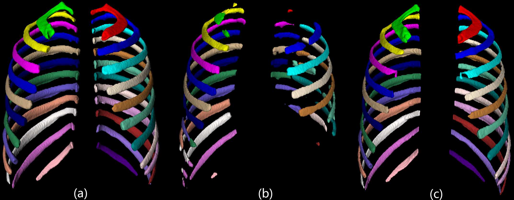
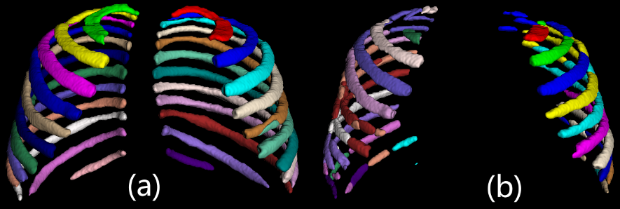

# <center> AutoOrgan 
  
📌 简介<br> 
<p align="center">
    
</p>

随着医学影像数据量的快速增长，手动标注变得愈发耗时且容易出错。为了解决这一问题，我们开发了 AutoOrgan, 一个专门用于 CT 影像中骨结构和器官的自动分割的深度学习框架 。该框架结合了现代语义分割模型与医学图像处理的最佳实践，能够高效、准确地对全身多个部位的骨骼进行识别和分割。

AutoOrgan 相较于当前主流的医学图像分割模型，具备多项独特且实用的优势。首先该框架在处理肋骨与椎骨等复杂解剖区域时，能够有效修复两者之间存在的缺损或连接断裂问题,如下图(b)所示，AutoOrgan可以在肋骨椎骨连接处生成高精度的分割图.
<p align="center">
    
</p>

此外，AutoOrgan 的训练数据集具有高度多样性，不仅涵盖了常规 CT 图像，还包括多种类型的增强型CT和PET/CT图像。这种多模态数据的支持使得AutoOrgan在面对不同成像条件和设备来源的数据时，依然能够保持良好的分割性能与泛化能力。如下图所示,左侧(a)为AutoOrgan的分割结果,右侧为另一个主流分割框架的结果.
<p align="center">
    
</p>
AutoOrgan支持多种常见骨结构（如颅骨、脊柱、肋骨、骨盆、四肢长骨等）和器官结构（例如大脑、心脏、肺部、肾脏等）的精确分割，具体的可分割部位，请参考请参考映射文件labels.json文件，并提供从数据预处理、模型推理到结果后处理的一站式解决方案。无论是科研还是工业应用，AutoOrgan都能帮助你快速实现高质量的分割任务。
</br>
<details>
<summary style="margin-left: 25px;">骨骼可分割部位</summary>
<div style="margin-left: 25px;">

<table>
  <tr>
    <th></th>
    <th>名称</th>
    <th>标签值</th>
  </tr>

  <tr>
    <td rowspan="6">全身总体骨骼</td>
    <td>颅骨</td>
    <td>1</td>
  </tr>

  <tr>
    <td>椎骨</td>
    <td>2</td>
  </tr>

  <tr>
    <td>肋骨</td>
    <td>3</td>
  </tr>
  <tr>
    <td>上肢</td>
    <td>4</td>
  </tr>
  <tr>
    <td>盆骨下肢</td>
    <td>5</td>
  </tr>    
  <tr>
    <td>下肢</td>
    <td>6</td>
  </tr>    

  <tr>
    <td rowspan="24">椎骨</td>
    <td>vertebrae_C1</td>
    <td>1</td>
  </tr>
  <tr>
    <td>vertebrae_C2</td>
    <td>2</td>
  </tr>
  <tr>
    <td>vertebrae_C3</td>
    <td>3</td>
  </tr>
  <tr>
    <td>vertebrae_C4</td>
    <td>4</td>
  </tr>
  <tr>
    <td>vertebrae_C5</td>
    <td>5</td>
  </tr>    
  <tr>
    <td>vertebrae_C6</td>
    <td>6</td>
  </tr>    
  <tr>
    <td>vertebrae_C7</td>
    <td>7</td>
  </tr>  
  <tr>
    <td>vertebrae_T1</td>
    <td>8</td>
  </tr>  
  <tr>
    <td>vertebrae_T2</td>
    <td>9</td>
  </tr>  
  <tr>
    <td>vertebrae_T3</td>
    <td>10</td>
  </tr>  
  <tr>
    <td>vertebrae_T4</td>
    <td>11</td>
  </tr>  
  <tr>
    <td>vertebrae_T5</td>
    <td>12</td>
  </tr>  
  <tr>
    <td>vertebrae_T6</td>
    <td>13</td>
  </tr>  
  <tr>
    <td>vertebrae_T7</td>
    <td>14</td>
  </tr>  
  <tr>
    <td>vertebrae_T8</td>
    <td>15</td>
  </tr>                    

  <tr>
    <td>vertebrae_T9</td>
    <td>16</td>
  </tr>    
  <tr>
    <td>vertebrae_T10</td>
    <td>17</td>
  </tr>    
  <tr>
    <td>vertebrae_11</td>
    <td>18</td>
  </tr>    
  <tr>
    <td>vertebrae_T12</td>
    <td>19</td>
  </tr>    
  <tr>
    <td>vertebrae_L1</td>
    <td>20</td>
  </tr>    
  <tr>
    <td>vertebrae_L2</td>
    <td>21</td>
  </tr>    
  <tr>
    <td>vertebrae_L3</td>
    <td>22</td>
  </tr>    
  <tr>
    <td>vertebrae_L4</td>
    <td>23</td>
  </tr>                  
  <tr>
    <td>vertebrae_L5</td>
    <td>24</td>
  </tr>   

  <tr>
    <td rowspan="24">肋骨</td>
    <td>rib_left_1</td>
    <td>1</td>
  </tr>

  <tr>
    <td>rib_right_1</td>
    <td>2</td>
  </tr>
  <tr>
    <td>rib_left_2</td>
    <td>3</td>
  </tr>
  <tr>
    <td>rib_right_2</td>
    <td>4</td>
  </tr>
  <tr>
    <td>rib_left_3</td>
    <td>5</td>
  </tr>    
  <tr>
    <td>rib_right_3</td>
    <td>6</td>
  </tr>    
  <tr>
    <td>rib_left_4</td>
    <td>7</td>
  </tr>  
  <tr>
    <td>rib_right_4</td>
    <td>8</td>
  </tr>  
  <tr>
    <td>rib_left_5</td>
    <td>9</td>
  </tr>  
  <tr>
    <td>rib_right_5</td>
    <td>10</td>
  </tr>  
  <tr>
    <td>rib_left_6</td>
    <td>11</td>
  </tr>  
  <tr>
    <td>rib_right_6</td>
    <td>12</td>
  </tr>  
  <tr>
    <td>rib_left_7</td>
    <td>13</td>
  </tr>  
  <tr>
    <td>rib_right_7</td>
    <td>14</td>
  </tr>  
  <tr>
    <td>rib_left_8</td>
    <td>15</td>
  </tr>                    

  <tr>
    <td>rib_right_8</td>
    <td>16</td>
  </tr>    
  <tr>
    <td>rib_left_9</td>
    <td>17</td>
  </tr>    
  <tr>
    <td>rib_right_9</td>
    <td>18</td>
  </tr>    
  <tr>
    <td>rib_left_10</td>
    <td>19</td>
  </tr>    
  <tr>
    <td>rib_right_10</td>
    <td>20</td>
  </tr>    
  <tr>
    <td>rib_left_11</td>
    <td>21</td>
  </tr>    
  <tr>
    <td>rib_right_11</td>
    <td>22</td>
  </tr>    
  <tr>
    <td>rib_left_12</td>
    <td>23</td>
  </tr>                  
  <tr>
    <td>rib_right_12</td>
    <td>24</td>
  </tr>   

  <tr>
    <td rowspan="16">下肢骨</td>
    <td>humerus_left</td>
    <td>1</td>
  </tr>
  <tr>
    <td>humerus_right</td>
    <td>2</td>
  </tr>
  <tr>
    <td>radius_left</td>
    <td>3</td>
  </tr>
  <tr>
    <td>radius_right</td>
    <td>4</td>
  </tr>
  <tr>
    <td>ulna_left</td>
    <td>5</td>
  </tr>    
  <tr>
    <td>ulna_right</td>
    <td>6</td>
  </tr>    
  <tr>
    <td>carpal_left</td>
    <td>7</td>
  </tr>  
  <tr>
    <td>carpal_right</td>
    <td>8</td>
  </tr>  
  <tr>
    <td>metacarpal_left</td>
    <td>9</td>
  </tr>  
  <tr>
    <td>metacarpal_right</td>
    <td>10</td>
  </tr>  
  <tr>
    <td>phalanges_hand_left</td>
    <td>11</td>
  </tr>  
  <tr>
    <td>phalanges_hand_right</td>
    <td>12</td>
  </tr>  
  <tr>
    <td>clavicula_left</td>
    <td>13</td>
  </tr>  
  <tr>
    <td>clavicula_right</td>
    <td>14</td>
  </tr>  
  <tr>
    <td>scapula_left</td>
    <td>15</td>
  </tr>                    

  <tr>
    <td>scapula_right</td>
    <td>16</td>
  </tr>    

  <tr>
    <td rowspan="3">盆骨</td>
    <td>hip_left</td>
    <td>1</td>
  </tr>
  <tr>
    <td>hip_right</td>
    <td>2</td>
  </tr>
  <tr>
    <td>sacrum</td>
    <td>3</td>
  </tr>

  <tr>
    <td rowspan="14">下肢骨</td>
    <td>femur_left</td>
    <td>1</td>
  </tr>
  <tr>
    <td>femur_right</td>
    <td>2</td>
  </tr>
  <tr>
    <td>patella_left</td>
    <td>3</td>
  </tr>
  <tr>
    <td>patella_right</td>
    <td>4</td>
  </tr>
  <tr>
    <td>tibia_left</td>
    <td>5</td>
  </tr>    
  <tr>
    <td>tibia_right</td>
    <td>6</td>
  </tr>    
  <tr>
    <td>fibula_left</td>
    <td>7</td>
  </tr>  
  <tr>
    <td>fibula_right</td>
    <td>8</td>
  </tr>  
  <tr>
    <td>tarsal_left</td>
    <td>9</td>
  </tr>  
  <tr>
    <td>tarsal_right</td>
    <td>10</td>
  </tr>  
  <tr>
    <td>metatarsal_left</td>
    <td>11</td>
  </tr>  
  <tr>
    <td>metatarsal_right</td>
    <td>12</td>
  </tr>  
  <tr>
    <td>phalanges_feet_left</td>
    <td>13</td>
  </tr>  
  <tr>
    <td>phalanges_feet_right</td>
    <td>14</td>
  </tr>  

  </tr>

</table>

</div>
</details>
</br>
<details>
<summary style="margin-left: 25px;">器官可分割部位</summary>
<div style="margin-left: 25px;">

<table>
  <tr>
    <th></th>
    <th>名称</th>
    <th>标签值</th>
  </tr>

  <tr>
    <td rowspan="24">器官</td>
    <td>spleen</td>
    <td>1</td>
  </tr>
  <tr>
    <td>kidney_right</td>
    <td>2</td>
  </tr>
  <tr>
    <td>kidney_left</td>
    <td>3</td>
  </tr>
  <tr>
    <td>gallbladder</td>
    <td>4</td>
  </tr>
  <tr>
    <td>liver</td>
    <td>5</td>
  </tr>    
  <tr>
    <td>stomach</td>
    <td>6</td>
  </tr>    
  <tr>
    <td>pancreas</td>
    <td>7</td>
  </tr>  
  <tr>
    <td>lung_upper_lobe_left</td>
    <td>8</td>
  </tr>  
  <tr>
    <td>lung_lower_lobe_left</td>
    <td>9</td>
  </tr>  
  <tr>
    <td>lung_upper_lobe_right</td>
    <td>10</td>
  </tr>  
  <tr>
    <td>lung_middle_lobe_right</td>
    <td>11</td>
  </tr>  
  <tr>
    <td>lung_lower_lobe_right</td>
    <td>12</td>
  </tr>  
  <tr>
    <td>esophagus</td>
    <td>13</td>
  </tr>  
  <tr>
    <td>trachea</td>
    <td>14</td>
  </tr>  
  <tr>
    <td>thyroid_gland</td>
    <td>15</td>
  </tr>                    

  <tr>
    <td>small_bowel</td>
    <td>16</td>
  </tr>    
  <tr>
    <td>duodenum</td>
    <td>17</td>
  </tr>    
  <tr>
    <td>colon</td>
    <td>18</td>
  </tr>    
  <tr>
    <td>urinary_bladder</td>
    <td>19</td>
  </tr>    
  <tr>
    <td>prostate</td>
    <td>20</td>
  </tr>    
  <tr>
    <td>heart</td>
    <td>21</td>
  </tr>    
  <tr>
    <td>aorta</td>
    <td>22</td>
  </tr>    
  <tr>
    <td>brain</td>
    <td>23</td>
  </tr>                  
  <tr>
    <td>spinal_cord</td>
    <td>24</td>
  </tr>   

  </tr>

</table>

</div>
</details>

📦 使用流程
### 1. 配置
我们模型的使用基于nnUNet框架,请参考下面的链接安装并配置nnUnet [nnUnet安装步骤](https://github.com/MIC-DKFZ/nnUNet/blob/master/documentation/installation_instructions.md )
### 2. 推理
请填写👉[调查问卷](https://www.vplustech.com/AutoOrgan-registration ),你将会在24h内收到回复, 然后请下载官方提供的预训练模型文件并解压至nnUNet_results目录。
请注意: **模型只允许被使用在非商业用途**.
  
在命令行中输入命令进行推理
```sh
CUDA_VISIBLE_DEVICES=GPU_ID nnUNetv2_predict -i INPUT_FOLDER  -o  OUTPUT_FOLDER  -d TASK_ID  -tr TrainerName  -f 0  -c 3d_fullres  --c -part_id X -num_parts Y
```
其中:
GPU_ID是指你使用的GPU序号
INPUT_FOLDER是待预测的CT图像文件夹
OUTPUT_FOLDER是预测结果输出文件夹
TASK_ID是任务ID
TrainerName是训练器(在我们的模型中默认使用nnUNetTrainerNoMirroring)
f是折数(在我们的模型中默认使用使用第0折)
--c表示跳过已存在的结果.
**可选:** -part_id X -num_parts Y 表示将推理数据集分成Y份,目前推理的是第X份(此策略这会消耗更多的内存和资源,但更快)
```sh
CUDA_VISIBLE_DEVICES=4 nnUNetv2_predict -i INPUT_FOLDER  -o  OUTPUT_FOLDER  -d TASK_ID  -tr TrainerName  -f 0  -c 3d_fullres  --c -part_id 0 -num_parts 2
CUDA_VISIBLE_DEVICES=5 nnUNetv2_predict -i INPUT_FOLDER  -o  OUTPUT_FOLDER  -d TASK_ID  -tr TrainerName  -f 0  -c 3d_fullres  --c -part_id 1 -num_parts 2
```
  
具体来说, 如果要执行肋骨分割任务,你需要执行下面的命令
```sh
CUDA_VISIBLE_DEVICES=0 nnUNetv2_predict -i /home/data/ct -o /home/data/ct_rib_result -d 888 -tr nnUNetTrainerNoMirroring -f 0 -c 3d_fullres --c 
```
### 3. 训练
   如果你想在我们的数据集上重新训练模型请, 请先通过邮件申请我们的精标注数据集, 然后按照以下步骤进行训练:
   1. 下载链接中的数据集
   2. 将数据集解压到nnUNet_raw目录下,并设置好对应的文件目录和dataset.json文件
   3. 依次在命令行运行预处理、训练命令
```
nnUNetv2_plan_and_preprocess -d <your_dataset_id> -pl ExperimentPlanner -c 3d_fullres
```
```
nnUNetv2_train <your_dataset_id> 3d_fullres 0 -tr nnUNetTrainerNoMirroring
```
### 4. 3d slicer插件功能：
   我们团队独立开发了一款基于AutoOrgan和3D Slicer的医学图像智能分割插件 —— AutoOrganSlicer，专注于为医生和研究人员提供高效、精准、易用的三维影像分割工具。
<p align="center">
    
</p>
此插件的主要功能如下：
  
✅ 支持多种医学图像格式（NIfTI、DICOM、NRRD 等  
✅ 可扩展性强，支持加载自定义模型与标签配置文件（JSON）
✅ 分割结果实时渲染展示，并可导出为标准 NIfTI 或 LabelMap 格式
✅ 支持 GPU 加速推理（可选）
✅ 基于 Python 和 Onnx 实现后端推理逻辑，与 3D Slicer 模块无缝集成。
    插件安装和使用指南请参考 [AutoOrganSlicer安装步骤](resources/images/插件使用方法.pdf ) -> 待完善
    [插件视频教程](https://drive.google.com/file/d/1mfA5MWDJ2bxYViVFUnDsLUwDoyHkbZ9t/view?usp=sharing)

🤝 贡献指南
欢迎贡献代码、改进文档、提交 issue 或分享你的使用经验！
请参考 CONTRIBUTING.md 获取详细说明。
  
📞 联系方式
如有任何疑问、合作意向或定制开发需求，请联系：

📧 Email: vplus@163.com
🌐 GitHub: https://github.com/hqllab/AutoOrgan
  
❤️ 致谢
感谢以下开源项目对本项目的启发与支持：
Wasserthal, J., Breit, H.-C., Meyer, M.T., Pradella, M., Hinck, D., Sauter, A.W., Heye, T., Boll, D., Cyriac, J., Yang, S., Bach, M., Segeroth, M., 2023. TotalSegmentator: Robust Segmentation of 104 Anatomic Structures in CT Images. Radiology: Artificial Intelligence. https://doi.org/10.1148/ryai.230024

Isensee, F., Jaeger, P.F., Kohl, S.A.A. et al. nnU-Net: a self-configuring method for deep learning-based biomedical image segmentation. Nat Methods 18, 203–211 (2021). https://doi.org/10.1038/s41592-020-01008-z

Shiyam Sundar, L. K., Yu, J., Muzik, O., Kulterer, O., Fueger, B. J., Kifjak, D., Nakuz, T., Shin, H. M., Sima, A. K., Kitzmantl, D., Badawi, R. D., Nardo, L., Cherry, S. R., Spencer, B. A., Hacker, M., & Beyer, T. (2022). Fully-automated, semantic segmentation of whole-body 18F-FDG PET/CT images based on data-centric artificial intelligence. Journal of Nuclear Medicine. https://doi.org/10.2967/jnumed.122.264063


感谢所有参与测试和反馈的医生、研究人员和开发者。AutoOrgan 的诞生离不开你们的支持与鼓励！

⚠️ 免责声明 ：本项目仅供学术研究和教学用途，不用于任何临床诊断或治疗决策。使用前请确保符合相关法规要求。 
  