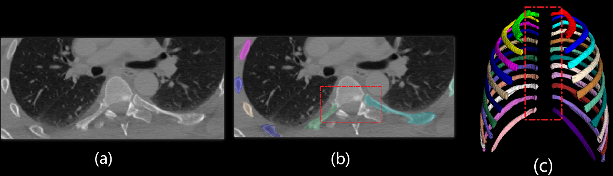

# <center> AutoOrgan 
  
<p align="center">
    
</p>
📌 Introduction<br> 
With the rapid growth of medical imaging data volume, manual annotation has become increasingly time-consuming and error-prone.To address this issue, we developed AutoOrgan, a deep learning framework specifically designed for the automatic segmentation of bone structures and organs in CT images.This framework combines the best practices of modern semantic segmentation models and medical image processing, and is capable of efficiently and accurately recognizing and segmenting the bones of multiple parts of the body.

Compared with the current mainstream medical image segmentation models, AutoOrgan has several unique and practical advantages.
Firstly, when dealing with complex anatomical regions such as ribs and vertebrae, this framework can effectively repair the defects or connection fractures existing between the two, as shown in Figure (b) below. AutoOrgan can generate high-precision segmentation maps at the connection points of ribs and vertebrae.
<p align="center">
    
</p>

In addition, the training dataset of AutoOrgan is highly diverse, covering not only conventional CT images but also various types of enhanced CT and PET/CT images.The support of this multimodal data enables AutoOrgan to maintain excellent segmentation performance and generalization ability when dealing with data from different imaging conditions and device sources.As shown in the following figure, the left (a) is the segmentation result of AutoOrgan, and the right (b) and (c) are the results of the two mainstream segmentation frameworks.
<p align="center">
    
</p>
AutoOrgan supports precise segmentation of various common bone structures (such as the skull, spine, ribs, pelvis, long bones of the limbs, etc.) and organ structures (such as the brain, heart, lungs, kidneys, etc.). For specific separable parts, please refer to the table listed below. It also provides a one-stop solution from data preprocessing, model inference to post-processing of results.Whether in scientific research or industrial applications, AutoOrgan can help you quickly achieve high-quality segmentation tasks.
</br>
<details>
<summary style="margin-left: 25px;">骨骼可分割部位(Bone part)</summary>
<div style="margin-left: 25px;">

<table>
  <tr>
    <th></th>
    <th>名称(Name)</th>
    <th>标签值(Label value)</th>
  </tr>

  <tr>
    <td rowspan="6">全身骨骼(The overall skeleton of the whole body)</td>
    <td>颅骨(Skull)</td>
    <td>1</td>
  </tr>

  <tr>
    <td>椎骨(Vertebrae)</td>
    <td>2</td>
  </tr>

  <tr>
    <td>肋骨(Rib)</td>
    <td>3</td>
  </tr>
  <tr>
    <td>上肢(Upper limb)</td>
    <td>4</td>
  </tr>
  <tr>
    <td>盆骨(Hip)</td>
    <td>5</td>
  </tr>    
  <tr>
    <td>下肢(Lower limb)</td>
    <td>6</td>
  </tr>    

  <tr>
    <td rowspan="24">细分椎骨(Vertebrae subdivision)</td>
    <td>椎骨C1(vertebrae_C1)</td>
    <td>1</td>
  </tr>
  <tr>
    <td>椎骨C2(vertebrae_C2)</td>
    <td>2</td>
  </tr>
  <tr>
    <td>椎骨C3(vertebrae_C3)</td>
    <td>3</td>
  </tr>
  <tr>
    <td>椎骨C4(vertebrae_C4)</td>
    <td>4</td>
  </tr>
  <tr>
    <td>椎骨C5(vertebrae_C5)</td>
    <td>5</td>
  </tr>    
  <tr>
    <td>椎骨C6(vertebrae_C6)</td>
    <td>6</td>
  </tr>    
  <tr>
    <td>椎骨C7(vertebrae_C7)</td>
    <td>7</td>
  </tr>  
  <tr>
    <td>椎骨T1(vertebrae_T1)</td>
    <td>8</td>
  </tr>  
  <tr>
    <td>椎骨T2(vertebrae_T2)</td>
    <td>9</td>
  </tr>  
  <tr>
    <td>椎骨T3(vertebrae_T3)</td>
    <td>10</td>
  </tr>  
  <tr>
    <td>椎骨T4(vertebrae_T4)</td>
    <td>11</td>
  </tr>  
  <tr>
    <td>椎骨T5(vertebrae_T5)</td>
    <td>12</td>
  </tr>  
  <tr>
    <td>椎骨T6(vertebrae_T6)</td>
    <td>13</td>
  </tr>  
  <tr>
    <td>椎骨T7(vertebrae_T7)</td>
    <td>14</td>
  </tr>  
  <tr>
    <td>椎骨T8(vertebrae_T8)</td>
    <td>15</td>
  </tr>                    

  <tr>
    <td>椎骨T9(vertebrae_T9)</td>
    <td>16</td>
  </tr>    
  <tr>
    <td>椎骨T10(vertebrae_T10)</td>
    <td>17</td>
  </tr>    
  <tr>
    <td>椎骨T11(vertebrae_T11)</td>
    <td>18</td>
  </tr>    
  <tr>
    <td>椎骨T12(vertebrae_T12)</td>
    <td>19</td>
  </tr>    
  <tr>
    <td>椎骨L1(vertebrae_L1)</td>
    <td>20</td>
  </tr>    
  <tr>
    <td>椎骨L2(vertebrae_L2)</td>
    <td>21</td>
  </tr>    
  <tr>
    <td>椎骨L3(vertebrae_L3)</td>
    <td>22</td>
  </tr>    
  <tr>
    <td>椎骨L4(vertebrae_L4)</td>
    <td>23</td>
  </tr>                  
  <tr>
    <td>椎骨L5(vertebrae_L5)</td>
    <td>24</td>
  </tr>   

  <tr>
    <td rowspan="24">细分肋骨(Rib subdivision)</td>
    <td>左肋骨1(rib_left_1)</td>
    <td>1</td>
  </tr>

  <tr>
    <td>右肋骨1(rib_right_1)</td>
    <td>2</td>
  </tr>
  <tr>
    <td>左肋骨2(rib_left_2)</td>
    <td>3</td>
  </tr>
  <tr>
    <td>右肋骨2(rib_right_2)</td>
    <td>4</td>
  </tr>
  <tr>
    <td>左肋骨3(rib_left_3)</td>
    <td>5</td>
  </tr>    
  <tr>
    <td>右肋骨3(rib_right_3)</td>
    <td>6</td>
  </tr>    
  <tr>
    <td>左肋骨4(rib_left_4)</td>
    <td>7</td>
  </tr>  
  <tr>
    <td>右肋骨4(rib_right_4)</td>
    <td>8</td>
  </tr>  
  <tr>
    <td>左肋骨5(rib_left_5)</td>
    <td>9</td>
  </tr>  
  <tr>
    <td>右肋骨5(rib_right_5)</td>
    <td>10</td>
  </tr>  
  <tr>
    <td>左肋骨6(rib_left_6)</td>
    <td>11</td>
  </tr>  
  <tr>
    <td>右肋骨6(rib_right_6)</td>
    <td>12</td>
  </tr>  
  <tr>
    <td>左肋骨7(rib_left_7)</td>
    <td>13</td>
  </tr>  
  <tr>
    <td>右肋骨7(rib_right_7)</td>
    <td>14</td>
  </tr>  
  <tr>
    <td>左肋骨8(rib_left_8)</td>
    <td>15</td>
  </tr>                    

  <tr>
    <td>右肋骨8(rib_right_8)</td>
    <td>16</td>
  </tr>    
  <tr>
    <td>左肋骨9(rib_left_9)</td>
    <td>17</td>
  </tr>    
  <tr>
    <td>右肋骨9(rib_right_9)</td>
    <td>18</td>
  </tr>    
  <tr>
    <td>左肋骨10(rib_left_10)</td>
    <td>19</td>
  </tr>    
  <tr>
    <td>右肋骨10(rib_right_10)</td>
    <td>20</td>
  </tr>    
  <tr>
    <td>左肋骨11(rib_left_11)</td>
    <td>21</td>
  </tr>    
  <tr>
    <td>右肋骨12(rib_right_11)</td>
    <td>22</td>
  </tr>    
  <tr>
    <td>左肋骨12(rib_left_12)</td>
    <td>23</td>
  </tr>                  
  <tr>
    <td>右肋骨12(rib_right_12)</td>
    <td>24</td>
  </tr>   

  <tr>
    <td rowspan="16">细分上肢骨(Upper limb subdivision)</td>
    <td>左肱骨(humerus_left)</td>
    <td>1</td>
  </tr>
  <tr>
    <td>右肱骨(humerus_right)</td>
    <td>2</td>
  </tr>
  <tr>
    <td>左桡骨(radius_left)</td>
    <td>3</td>
  </tr>
  <tr>
    <td>右桡骨(radius_right)</td>
    <td>4</td>
  </tr>
  <tr>
    <td>左尺骨(ulna_left)</td>
    <td>5</td>
  </tr>    
  <tr>
    <td>右尺骨(ulna_right)</td>
    <td>6</td>
  </tr>    
  <tr>
    <td>左腕关节(carpal_left)</td>
    <td>7</td>
  </tr>  
  <tr>
    <td>右腕关节(carpal_right)</td>
    <td>8</td>
  </tr>  
  <tr>
    <td>左掌骨(metacarpal_left)</td>
    <td>9</td>
  </tr>  
  <tr>
    <td>右掌骨(metacarpal_right)</td>
    <td>10</td>
  </tr>  
  <tr>
    <td>左指骨(phalanges_hand_left)</td>
    <td>11</td>
  </tr>  
  <tr>
    <td>右指骨(phalanges_hand_right)</td>
    <td>12</td>
  </tr>  
  <tr>
    <td>左锁骨(clavicula_left)</td>
    <td>13</td>
  </tr>  
  <tr>
    <td>右锁骨(clavicula_right)</td>
    <td>14</td>
  </tr>  
  <tr>
    <td>左肩胛骨(scapula_left)</td>
    <td>15</td>
  </tr>                    

  <tr>
    <td>右肩胛骨(scapula_right)</td>
    <td>16</td>
  </tr>    

  <tr>
    <td rowspan="3">细分盆骨(Hip subdivision)</td>
    <td>左髋骨(hip_left)</td>
    <td>1</td>
  </tr>
  <tr>
    <td>右髋骨(hip_right)</td>
    <td>2</td>
  </tr>
  <tr>
    <td>骶骨(sacrum)</td>
    <td>3</td>
  </tr>

  <tr>
    <td rowspan="14">细分下肢骨(Lower limb subdivision)</td>
    <td>左股骨(femur_left)</td>
    <td>1</td>
  </tr>
  <tr>
    <td>右股骨(femur_right)</td>
    <td>2</td>
  </tr>
  <tr>
    <td>左膝盖骨(patella_left)</td>
    <td>3</td>
  </tr>
  <tr>
    <td>右膝盖骨(patella_right)</td>
    <td>4</td>
  </tr>
  <tr>
    <td>左胫骨(tibia_left)</td>
    <td>5</td>
  </tr>    
  <tr>
    <td>右胫骨(tibia_right)</td>
    <td>6</td>
  </tr>    
  <tr>
    <td>左腓骨(fibula_left)</td>
    <td>7</td>
  </tr>  
  <tr>
    <td>右腓骨(fibula_right)</td>
    <td>8</td>
  </tr>  
  <tr>
    <td>左跗骨(tarsal_left)</td>
    <td>9</td>
  </tr>  
  <tr>
    <td>右跗骨(tarsal_right)</td>
    <td>10</td>
  </tr>  
  <tr>
    <td>左跖骨(metatarsal_left)</td>
    <td>11</td>
  </tr>  
  <tr>
    <td>右跖骨(metatarsal_right)</td>
    <td>12</td>
  </tr>  
  <tr>
    <td>左脚趾骨(phalanges_feet_left)</td>
    <td>13</td>
  </tr>  
  <tr>
    <td>右脚趾骨(phalanges_feet_right)</td>
    <td>14</td>
  </tr>  

  </tr>

</table>

</div>
</details>
<details>
<summary style="margin-left: 25px;">器官可分割部位(Organ part)</summary>
<div style="margin-left: 25px;">

<table>
  <tr>
    <th></th>
    <th>名称(Name)</th>
    <th>标签值(Label value)</th>
  </tr>

  <tr>
    <td rowspan="24">器官(Organ)</td>
    <td>脾脏(spleen)</td>
    <td>1</td>
  </tr>
  <tr>
    <td>右肾脏(kidney_right)</td>
    <td>2</td>
  </tr>
  <tr>
    <td>左肾脏(kidney_left)</td>
    <td>3</td>
  </tr>
  <tr>
    <td>胆囊(gallbladder)</td>
    <td>4</td>
  </tr>
  <tr>
    <td>肝脏(liver)</td>
    <td>5</td>
  </tr>    
  <tr>
    <td>胃(stomach)</td>
    <td>6</td>
  </tr>    
  <tr>
    <td>胰腺(pancreas)</td>
    <td>7</td>
  </tr>  
  <tr>
    <td>左肺上叶(lung_upper_lobe_left)</td>
    <td>8</td>
  </tr>  
  <tr>
    <td>左肺下叶(lung_lower_lobe_left)</td>
    <td>9</td>
  </tr>  
  <tr>
    <td>右肺上叶(lung_upper_lobe_right)</td>
    <td>10</td>
  </tr>  
  <tr>
    <td>右肺中叶(lung_middle_lobe_right)</td>
    <td>11</td>
  </tr>  
  <tr>
    <td>右肺下叶(lung_lower_lobe_right)</td>
    <td>12</td>
  </tr>  
  <tr>
    <td>食管(esophagus)</td>
    <td>13</td>
  </tr>  
  <tr>
    <td>气管(trachea)</td>
    <td>14</td>
  </tr>  
  <tr>
    <td>甲状腺(thyroid_gland)</td>
    <td>15</td>
  </tr>                    

  <tr>
    <td>小肠(small_bowel)</td>
    <td>16</td>
  </tr>    
  <tr>
    <td>十二指肠(duodenum)</td>
    <td>17</td>
  </tr>    
  <tr>
    <td>结肠(colon)</td>
    <td>18</td>
  </tr>    
  <tr>
    <td>膀胱(urinary_bladder)</td>
    <td>19</td>
  </tr>    
  <tr>
    <td>前列腺(prostate)</td>
    <td>20</td>
  </tr>    
  <tr>
    <td>心脏(heart)</td>
    <td>21</td>
  </tr>    
  <tr>
    <td>主动脉(aorta)</td>
    <td>22</td>
  </tr>    
  <tr>
    <td>大脑(brain)</td>
    <td>23</td>
  </tr>                  
  <tr>
    <td>脊髓(spinal_cord)</td>
    <td>24</td>
  </tr>   

  </tr>

</table>

</div>
</details>

📦 Usage process
### 1. Configuration 
The use of our model is based on the nnUNet framework. Please refer to the link below to install and configure nnUnet [nnUnet install guidance](https://github.com/MIC-DKFZ/nnUNet/blob/master/documentation/installation_instructions.md )
### 2. Inference 
Please fill in👉[registration information](https://www.vplustech.com/AutoOrgan-registration ),You will receive a reply within 24 hours. Then please download the pre-trained model file provided by the official and extract it to the nnUNet_results directory.
Please note: **The model is only permitted to be used for non-commercial purposes.**
  
Enter commands in the command line for reasoning
```sh
CUDA_VISIBLE_DEVICES=GPU_ID nnUNetv2_predict -i INPUT_FOLDER  -o  OUTPUT_FOLDER  -d TASK_ID  -tr TrainerName  -f 0  -c 3d_fullres  --c -part_id X -num_parts Y
```
Among them:
"GPU_ID" refers to the serial number of the GPU you are using
INPUT_FOLDER is the folder of CT images to be predicted
OUTPUT_FOLDER is the folder for outputting the prediction results
TASK_ID is the task ID.
</details>
<details>
<summary style="margin-left: 25px;">Task ID对照表(Task ID comparison table)</summary>
<div style="margin-left: 25px;">

<table>
  <tr>
    <th>任务名称(Task Name)</th>
    <th>任务Task ID(Task ID)</th>
  </tr>

  <tr>
    <td>全身骨骼(The overall skeleton of the whole body)</td>
    <td>106</td>
  </tr>
  <tr>
    <td>细分椎骨(Vertebrae subdivision)</td>
    <td>108</td>
  </tr>
  <tr>
    <td>细分肋骨(Rib subdivision)</td>
    <td>998</td>
  </tr>
  <tr>
    <td>细分上肢骨(Upper limb subdivision)</td>
    <td>113</td>
  </tr>    
  <tr>
    <td>细分盆骨(Hip subdivision)</td>
    <td>114</td>
  </tr>    

  <tr>
    <td>细分下肢骨(Lower limb subdivision)</td>
    <td>112</td>
  </tr> 

  <tr>
    <td>器官(Organ part)</td>
    <td>999</td>
  </tr> 

  </tr>

</table>

</div>
</details>

TrainerName is the trainer (nnUNetTrainerNoMirroring is used by default in our model)
f is the number of folds (in our model, the 0th fold is used by default)
--c indicates skipping an existing result.
**Optional:** -part_id X -num_parts Y. It indicates that the inference dataset is divided into Y parts. Currently, the XTH part is being inferred (this strategy will consume more memory and resources, but it is faster).
```sh
CUDA_VISIBLE_DEVICES=4 nnUNetv2_predict -i INPUT_FOLDER  -o  OUTPUT_FOLDER  -d TASK_ID  -tr TrainerName  -f 0  -c 3d_fullres  --c -part_id 0 -num_parts 2
CUDA_VISIBLE_DEVICES=5 nnUNetv2_predict -i INPUT_FOLDER  -o  OUTPUT_FOLDER  -d TASK_ID  -tr TrainerName  -f 0  -c 3d_fullres  --c -part_id 1 -num_parts 2
```
  
Specifically, if you want to perform the rib segmentation task, you need to execute the following command:
```sh
CUDA_VISIBLE_DEVICES=0 nnUNetv2_predict -i /home/data/ct -o /home/data/ct_rib_result -d 888 -tr nnUNetTrainerNoMirroring -f 0 -c 3d_fullres --c 
```
### 3. Training
   If you wish to retrain the model on our dataset, please first apply for our highly labeled dataset via email, and then follow the steps below for training::
   1. Download the dataset in the link
   2. Unzip the dataset to the nnUNet_raw directory and set up the corresponding file directory and dataset.json file
   3. Run the preprocessing and training commands in sequence on the command line
```
nnUNetv2_plan_and_preprocess -d <your_dataset_id> -pl ExperimentPlanner -c 3d_fullres
```
```
nnUNetv2_train <your_dataset_id> 3d_fullres 0 -tr nnUNetTrainerNoMirroring
```
### 4. 3d slicer plugin:
   Our team independently developed an intelligent medical image segmentation plugin based on AutoOrgan and 3D Slicer - AutoOrganSlicer, dedicated to providing doctors and researchers with an efficient, accurate and user-friendly 3D image segmentation tool.
<p align="center">
    
</p>
The main functions of this plugin are as follows:：
  
✅ Supports multiple medical image formats (NIfTI, DICOM, NRRD, etc.)<br>
✅ Highly extensible and supports loading custom model and tag configuration files<br>
✅ The segmentation results are rendered and displayed in real time and can be exported in standard NIfTI or LabelMap format<br>
✅ Supports GPU-accelerated inference (optional)<br>
✅ Implements back-end inference logic based on Python and Onnx, seamlessly integrated with the 3D Slicer module<br>
    Please refer to the guide for plugin installation and usage [AutoOrganSlicer installation steps](resources/images/插件使用方法.pdf ) <br>
    [Plugin video tutorial](https://drive.google.com/file/d/1mfA5MWDJ2bxYViVFUnDsLUwDoyHkbZ9t/view?usp=sharing)

🤝 Contribution Guide<br>
Welcome to contribute code, improve documentation, submit issues or share your usage experiences!
  
📞 Contact information<br>
If you have any questions, cooperation intentions or custom development needs, please contact:

📧 Email: autoorgan@vplustech.com
🌐 GitHub: https://github.com/hqllab/AutoOrgan

❤️ Acknowledgments<br>
Thank you to the following open source projects for inspiring and supporting this project:
Wasserthal, J., Breit, H.-C., Meyer, M.T., Pradella, M., Hinck, D., Sauter, A.W., Heye, T., Boll, D., Cyriac, J., Yang, S., Bach, M., Segeroth, M., 2023. TotalSegmentator: Robust Segmentation of 104 Anatomic Structures in CT Images. Radiology: Artificial Intelligence. https://doi.org/10.1148/ryai.230024

Isensee, F., Jaeger, P.F., Kohl, S.A.A. et al. nnU-Net: a self-configuring method for deep learning-based biomedical image segmentation. Nat Methods 18, 203–211 (2021). https://doi.org/10.1038/s41592-020-01008-z

Shiyam Sundar, L. K., Yu, J., Muzik, O., Kulterer, O., Fueger, B. J., Kifjak, D., Nakuz, T., Shin, H. M., Sima, A. K., Kitzmantl, D., Badawi, R. D., Nardo, L., Cherry, S. R., Spencer, B. A., Hacker, M., & Beyer, T. (2022). Fully-automated, semantic segmentation of whole-body 18F-FDG PET/CT images based on data-centric artificial intelligence. Journal of Nuclear Medicine. https://doi.org/10.2967/jnumed.122.264063


Thank you to all the doctors, researchers and developers who participated in the testing and provided feedback.The birth of AutoOrgan could not have been possible without your support and encouragement!

⚠️ Disclaimer ：<br>This project is for academic research and teaching purposes only and is not intended for any clinical diagnosis or treatment decisions.Please ensure compliance with relevant regulations before use.
  